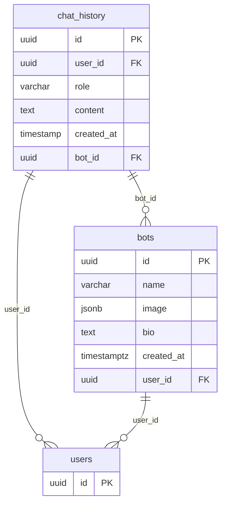

# AiSpace - Fullstack ai chat app

The project is for take-home assignment usage.

- [Nuxt.js](https://nuxt.com/): Utilized for its robust ecosystem and built-in support for isomorphic rendering, simplifying both server-side and client-side development.
- [Supabase](https://supabase.com/)(Postgres): I'm just learning it and see what's possible :) . For chat app usage, I think Firebase like document based NO SQL DB might be more suitable.
- [Vue Shadcn](https://www.shadcn-vue.com/): For it's fast and flexible tailwind config & components.
- [Swiper](https://swiperjs.com/): Easy and most widely used carousel library.
- [Gemini AI](https://ai.google.dev/gemini-api/docs): Powerful chatbot that has generous free usage.
- [Zod](https://zod.dev/): TypeScript-first schema validation for frontend form validation and backend data validation.



## Requirement

Build a Tinder like chat app include these feature:
- Recommendation list for user to like
- like and pass
- Chat room
  
## Setup

1. Create `.env` base on `.env.example` file
2. You can use `generate-db-type` in npm script to generate supabase typescript type

Make sure to install dependencies:

```bash
pnpm install
```

## Development Server

Start the development server on `http://localhost:3000`:

```bash
pnpm dev
```

## Production

Build the application for production:

```bash
pnpm build
```

Locally preview production build:

```bash
pnpm preview
```
